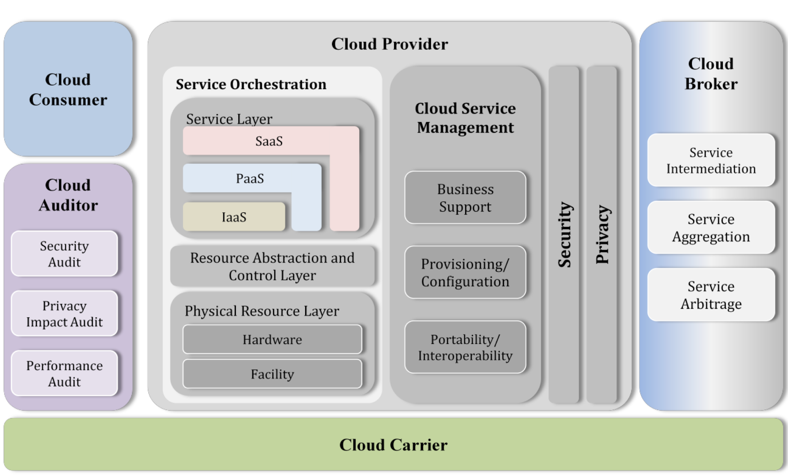

# Security in Cloud Computing

* [Cloud Computing Basics](#cloud-computing-basics)
  * [Cloud Computing Types](#cloud-computing-types)
    * [Infrastructure as a Service (IaaS)](#infrastructure-as-a-service-(iaas))
    * [Platform as a Service (Paas)](#platform-as-a-service-(paas))
    * [Software as a Service (SaaS)](#software-as-a-service-(saas))
  * [Deployment Models](#deployment-models)
    * [Public Cloud](#public-cloud)
    * [Private Cloud](#private-cloud)
    * [Community Cloud](#community-cloud)
    * [Hybrid Cloud](#hybrid-cloud)
  * [NIST Cloud Architecture](#nist-cloud-architecture)
    * [Major Roles](#major-roles)
* [Cloud Security](#cloud-security)
  * [Trusted Computing Model](#trusted-computing-model)
  * [Cloud Control Layers](#cloud-control-layers)
  * [Tools](#tools)
* [Threats and Attacks](#threats-and-attacks)

## Cloud Computing Basics

### Cloud Computing Types

| Type | Client Responsibility                          | Provider Responsiblity                                                                            |
| ---- | ---------------------------------------------- | ------------------------------------------------------------------------------------------------- |
| IaaS | applications   data   middleware   OS | virtualization    hardware   networking                                                     |
| PaaS | applications   data                         | middleware   OS  virtualization    hardware   networking                                 |
| SaaS |                                                | applications   data   middleware   OS   virtualization    hardware   networking |

#### Infrastructure as a Service (IaaS)

- Provides virtualized computing resources
- Third party hosts infrastructure components, applications and services with a _hypervisor_ running the VMs as guests
- Good choice for day-to-day infrastructure service, for temporary or experimental workloads that may change unexpectedly
- Subscribers usually pay on a per-use basis

#### Platform as a Service (Paas)

- Geared towards software development
- Provides development platform to develop applications without building the infrastructure
- Provides ability to develop without having to worry about hardware or software that is hosted by provider
- Does not replace the organizations actual infrastructure

#### Software as a Service (SaaS)

- Provider supplies on-demand applications to subscribers
- Basically a software distribution model
- Benefits are easier administration, automated patch management, compatibility and version control

### Deployment Models

#### Public Cloud

- Services provided over a network that is open for public to use
- Used when compliance and security requirements is not a major issue

#### Private Cloud

- Cloud solely for use by one tenant
- Not pay-as-you-go
- Usually done in larger organizations, because hardware is dedicated and security nad compliance requirements can be easily met

#### Community Cloud

- Infrastructure shared by several organizations, but not open to public
- Usually shared by organizations having the same policy and compliance considerations

#### Hybrid Cloud

- A composition of two or more cloud deployment models

### NIST Cloud Architecture

- National Institutes of Standards and Technology
- **Federal Risk and Authorization Management Programm** (FedRAMP) - auditable framework for ensuring basic security controls for government cloud effort; provides approach tos ecurity assessment, authorization and continuous monitoring for cloud
- **PCI Data Security Standard** (PCI DSS) - regulatory compliance effort for cloud 
- **FIPS**
- **Cloud Security Alliance** (CSA) - provides cloud security best practices; general cloud enterprise architecutre model; documentation on privacy concerns, security controls and implementation

#### Major Roles
- **Cloud Carrier** - organization with responsibility of transferring data; intermediary for connectivity and transport between subscriber and provider
- **Cloud Consumer** - aquires and uses cloud products and services
- **Cloud Provider** - purveyor of products and services
- **Cloud Broker** - manages use, performance and delivery of services as well as relationships betwen providers and subscribers
- **Cloud Auditor** - independent assor of cloud service an security controls

<!---->

## Cloud Security

- Where does security testing starts and where does it end?
- If the hypervisor is compromised, all hosts on that hypervisor are as well

### Trusted Computing Model

- attempts to resolve computer security problems through hardware enhancements and associated software modifications
- **Trusted Computing Group** (TCG) - hardware and software providers who cooporate to come up with specific plans
- **Roots of Trust** (RoT) - set of functions within TCM that are always trusted by the OS

### Cloud Control Layers

| Layer                | Control                                                                                                                             |
| -------------------- | ----------------------------------------------------------------------------------------------------------------------------------- |
| applications         | Web app firewalls; software development life cycle; binary analysis; application scanners; etc.                                     |
| information          | database monitoring; encryption; data loss prevention; content management framework, etc.                                           |
| management           | patch and configuration management; governance and compliance; virtual machine administration; identity and access management; etc. |
| network              | firewalls; network intrusion detection/prevention; quality of service; DNS security; etc.                                           |
| trusted computing    | hardware and software roots of trust and APIs; etc.                                                                                 |
| computer and storage | host-based intrusion detection/prevention and firewalls; log management; file integrity efforts; encryption; etc.                   |
| physical             | physical security measures; video monitoring; guards; etc.                                                                          |

### Tools

- **CloudInspect** - pen-testing as a service from AWS for EC2 users
- **CloudPassage Halo** - delivered as a service; instant visibility and continuous protection for servers in any cloud
- **Dell Cloud Manager**
- **Qualys Cloud Suite**
- **Trend Micro's Instant-On Cloud Security**
- **Panda Cloud Office Protection**

## Threats and Attacks

- **Data Breach or Loss** - biggest threat; includes malicious theft, erasure or modification; MFA and encryption as protection
- **Shadow IT** - IT systems or solutions that are developed to handle an issue but aren't taken through proper approval chain
- **Abuse of Cloud Resources** -  another high threat (usually applies to Iaas and PaaS); use resources for hacking; providers counter measure is monitoring, protection and recovery
- **Insecure Interfaces and APIs** - cloud services can't function without them, but need to make sure they are secure; counter measure is encryption and authorization access;
- **Service Oriented Architecture** - API that makes it easier for application components to cooperate and exchange information
- **Insufficient due diligence** - moving an application without knowing the security differences of the cloud environment
- **Shared technology issues** - multi-tenant environments that don't provide proper isolation
- **Unknown risk profiles** - subscribers simply don't know what security provisions are made in the background
- Others include malicious insiders, inadequate design and DDoS
- **Wrapping Attack** - SOAP message intercepted and data in envelope is changed and sent/replayed
- **Session riding** - CSRF under a different name; deals with cloud services instead of traditional data centers
- **Side Channel Attack/cross-guest VM breach** -  using an existing VM on the same physical host to attack another
